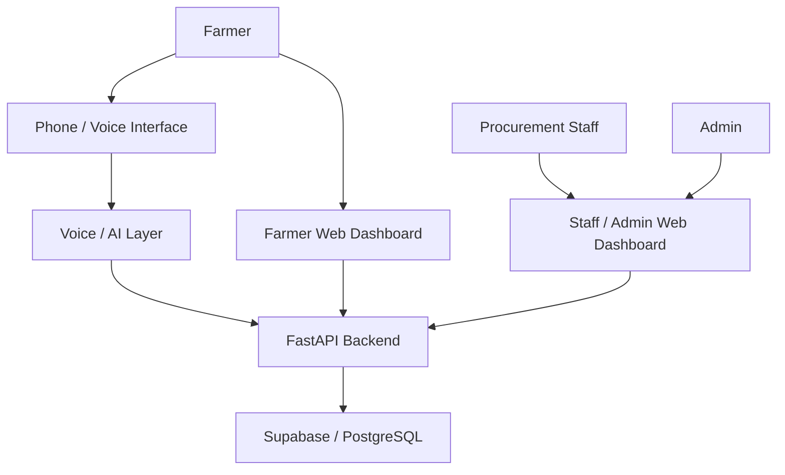
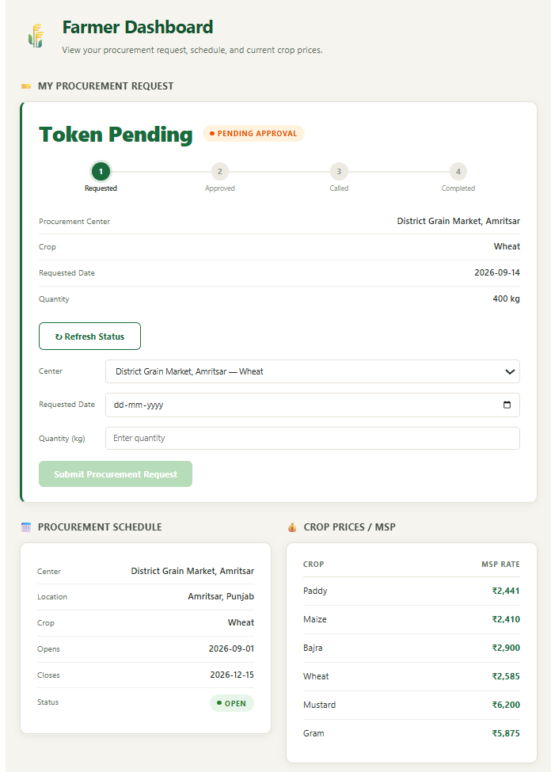
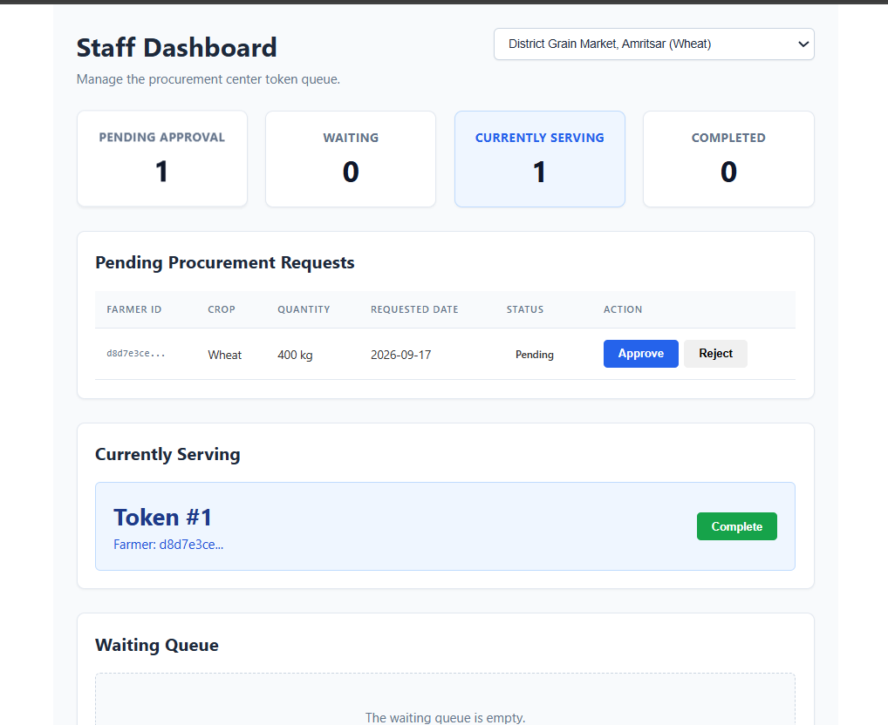
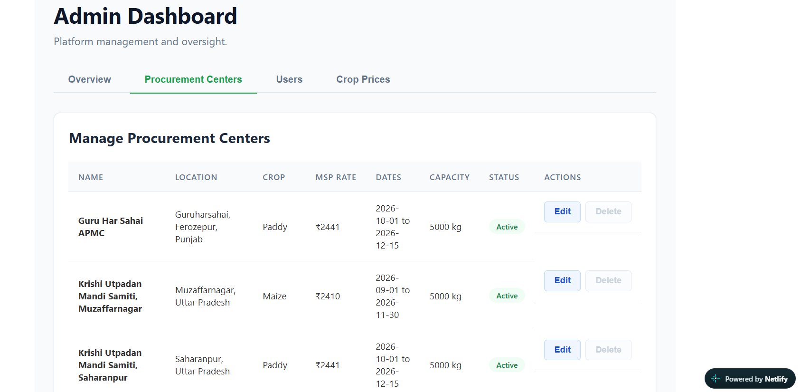

# KisanSaarthi — Smart Procurement Platform for Farmers

**Problem Statement:** PS26032 — Ministry of Consumer Affairs, Food & Public Distribution  
**Theme:** Smart Automation  
**Team:** Solstice · Netaji Subhas University of Technology (NSUT)

---

## Overview

KisanSaarthi is a smart procurement platform designed to simplify and modernize the crop procurement process for farmers and government procurement centres.

Farmers can interact with the platform through **two access channels**:

- **Web Dashboard** — for submitting and tracking procurement requests
- **Phone / Voice Interface** — for interacting with the system through a voice-based call interface

Procurement staff and administrators access the system through dedicated **web dashboards** to manage procurement requests, tokens, queues, centres, and related operations.

A centralized backend connects all these interfaces with the database and supporting services, providing a unified procurement workflow.

---

## Problem

Farmers can face long waiting times, limited visibility into procurement schedules, and uncertainty about the status of their requests at government procurement centres.

At the same time, procurement-centre staff require an organized system to manage requests, queues, token allocation, and daily procurement capacity.

KisanSaarthi addresses these challenges through a centralized, role-based, and accessible digital procurement workflow.

---

## Solution

KisanSaarthi connects farmers, procurement staff, and administrators through a common digital platform.

Farmers can submit procurement requests through the web dashboard or use the voice interface for supported operations. Procurement staff can review and manage requests from their dashboard, while administrators can manage system and centre-level information.

The backend handles the core business logic and connects the user interfaces with the underlying database and integrated services.

---

## System Architecture



### Access Model

| User                  | Access Channel                        | Main Responsibilities                                                         |
| --------------------- | ------------------------------------- | ----------------------------------------------------------------------------- |
| **Farmer**            | Web Dashboard / Phone Voice Interface | Submit procurement requests, track requests, and receive procurement updates  |
| **Procurement Staff** | Web Dashboard                         | Review requests, manage tokens, queues, capacity, and procurement operations  |
| **Admin**             | Web Dashboard                         | Manage procurement centres, system information, and administrative operations |

---

### Procurement Workflow

1. **Farmer submits a request** through the web dashboard or supported voice interface.
2. **Backend processes the request** and performs the required validation.
3. **Procurement staff review the request** through the staff dashboard.
4. **Token and queue management** is handled according to the procurement workflow and centre capacity.
5. **Staff update the token/request status** as the procurement progresses.
6. **Farmer tracks the latest status** through the web dashboard or supported voice interface.

---

## Key Features

- **Role-based dashboards** for Farmer, Procurement Staff, and Admin
- **Digital procurement request** submission and management
- **Token request and staff approval workflow**
- **Real-time queue management**
- **Procurement status tracking**
- **Per-centre daily capacity management**
- **Crop price (MSP) and procurement schedule visibility**
- **Phone-based voice interaction** for supported farmer operations
- **Authentication and role-based access control**
- **Centralized backend and database architecture**
- **Deployed frontend and backend services**

---

## Tech Stack

### Frontend

- React
- Vite
- JavaScript

### Backend

- FastAPI
- Python

### Database & Authentication

- Supabase
- PostgreSQL
- Supabase Authentication

### Voice / AI

- Vapi
- Voice-based interaction layer integrated with the backend

### Deployment

- Netlify — Frontend
- Railway — Backend
- Supabase — Database and authentication

---

## Live Links

- **Live Website:** https://kisansaarthi-032.netlify.app/
- **Backend API Documentation:** https://sih26-ps26032-production.up.railway.app/docs

---

## Screenshots

Project screenshots are available in
[`assets/screenshots/`](./assets/screenshots/).

### Farmer Dashboard



### Procurement Staff Dashboard



### Admin Dashboard



### Procurement / Token Workflow

---

## Demo Video

[Watch the project demonstration](./submission/DEMO.md)

---

## Presentation

See [`submission/PRESENTATION.md`](./submission/PRESENTATION.md) for the
presentation / pitch deck.

---

## Documentation

- [System Architecture](./docs/architecture.md)
- [API Reference](./docs/api.md)
- [Database Schema](./docs/database.md)

---

## Repository Structure

```text
sih26-ps26032/
│
├── frontend/                         # React + Vite web application
│   ├── src/                          # Frontend source code
│   ├── public/                       # Static assets
│   └── package.json                  # Frontend dependencies
│
├── backend/                          # FastAPI backend
│   ├── routers/                      # API routes
│   ├── services/                     # Business logic / integrations
│   ├── tests/                        # Backend tests
│   └── main.py                       # Backend entry point
│
├── docs/                             # Technical documentation
│   ├── architecture.md               # System architecture
│   ├── api.md                        # API documentation
│   └── database.md                   # Database documentation
│
├── assets/
│   └── screenshots/                  # Project screenshots
│
├── submission/                       # SIH submission material
│   ├── PRESENTATION.md               # Presentation information
│   └── DEMO.md                       # Demo video information
│
├── SUBMISSION_GUIDE.md               # Submission navigation guide
├── README.md                         # Project overview
└── .gitignore                        # Git ignore rules
```

---

## Team — Solstice

| Member        | Role                    |
| ------------- | ----------------------- |
| [Member Name] | [Role / Responsibility] |
| [Member Name] | [Role / Responsibility] |
| [Member Name] | [Role / Responsibility] |
| [Member Name] | [Role / Responsibility] |
| [Member Name] | [Role / Responsibility] |
| [Member Name] | [Role / Responsibility] |

---

## Future Scope

- Regional-language voice support
- Additional accessibility options
- DTMF / keypad-based fallback for supported phone interactions
- SMS and notification integrations
- Expanded procurement-centre analytics
- Further automation of procurement workflows

---

## License

This project was developed for **Smart India Hackathon 2026**.
